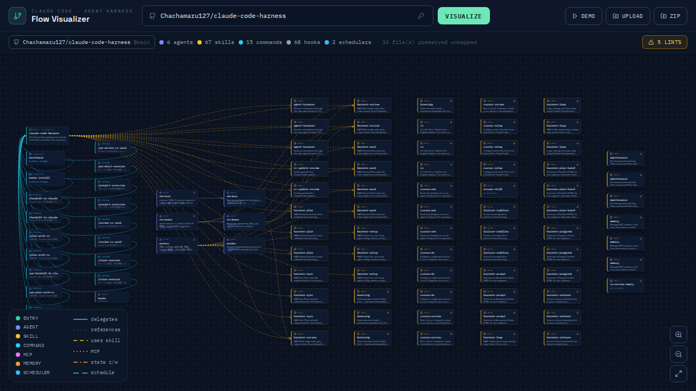
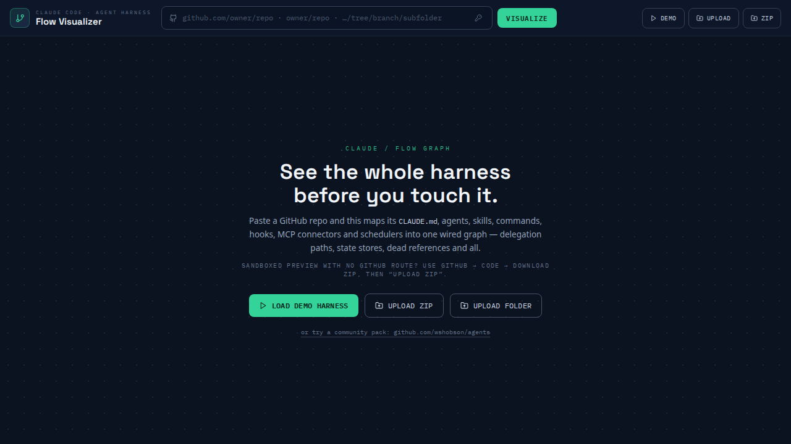
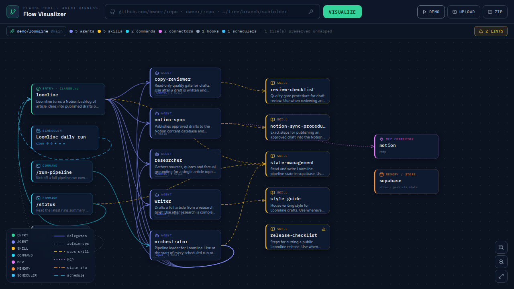
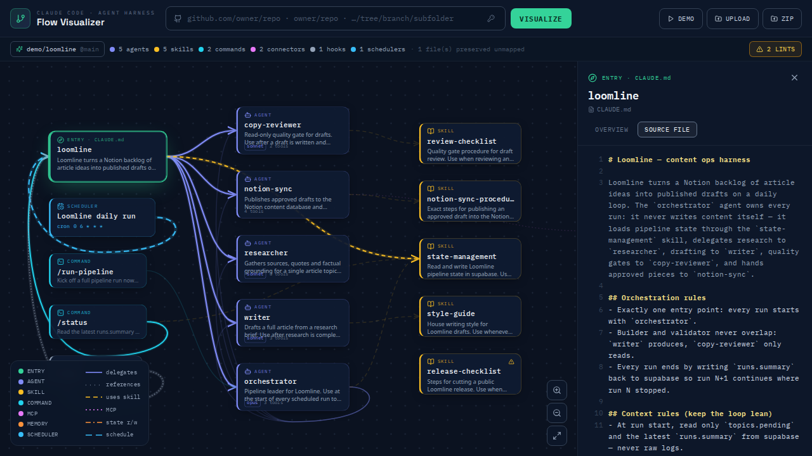

# Claude Code Flow Visualizer — See Your Entire Agent Harness as an Interactive Graph

**Visualize any Claude Code configuration (`CLAUDE.md`, subagents, skills, slash commands, hooks, MCP servers, schedulers) as one interactive flow diagram — straight from a GitHub URL, a ZIP, or a local folder. No install for your target repo, no backend, 100% client-side.**



## Why

Claude Code agent setups live as scattered markdown files: `CLAUDE.md`, `.claude/agents/*.md`, `.claude/skills/*/SKILL.md`, commands, `settings.json` hooks, and `.mcp.json` connectors. To understand how an existing harness works — which agent delegates to which, what skills fire when, where Notion/database/MCP connections plug in — you'd normally have to open and read every single file.

This tool parses the whole project and renders it as a wired graph in seconds:

- 🤖 **Agents** with model + tool badges, delegation edges traced from prompt bodies
- 📚 **Skills** attached to the agents and commands that actually reference them
- ⌨️ **Slash commands**, 🪝 **lifecycle hooks**, ⏰ **schedulers** (GitHub Actions / cron)
- 🔌 **MCP connectors** and 🗄️ **memory / state stores** drawn as distinct node types
- 🚨 **Pipeline lints**: broken delegation references, duplicate agent names, circular delegation, orphan skills, reviewers with write access, orchestrators missing the `Task` tool, vague trigger descriptions

## Quick Start

```bash
git clone https://github.com/oyekamal/claude-code-flow-visualizer.git
cd claude-code-flow-visualizer
npm install
npm run dev        # → http://localhost:5173
```

Then either:

1. **Paste a GitHub repo** (`owner/repo`, full URL, or a `/tree/branch/subfolder` link) and hit **VISUALIZE**
2. **Upload a ZIP** (GitHub → Code → Download ZIP) — fully offline
3. **Upload a folder** — point it at any local clone
4. Or click **LOAD DEMO HARNESS** to explore a sample multi-agent content pipeline



## Features

### Interactive canvas

Pan, zoom, and drag nodes. Hover or select any node to highlight its wiring. Edge styles encode meaning: solid = delegation, dashed = skill use, dotted = MCP connection, dash-dot = state reads/writes, animated = scheduled loop.



### Node inspector with raw source

Click any agent, skill, command, hook, or connector to see its description trigger, model, tools, incoming/outgoing references — and the underlying markdown file, side by side.



### Pipeline lints ("don't break my harness")

The validator catches the ways multi-agent pipelines actually break:

| Check | Level |
|---|---|
| Delegation to an agent/skill that doesn't exist | error |
| Orchestrator delegates but lacks the `Task` tool | error |
| Duplicate agent names (later file shadows earlier) | warn |
| Circular delegation loops | warn |
| Reviewer/validator agents holding write tools | warn |
| Skills never referenced by anything (dead weight) | warn |
| Missing or vague descriptions (agents never auto-trigger) | warn/info |
| MCP servers configured but never used | info |

### Three import transports

1. **GitHub API + raw.githubusercontent** (supports private repos via token)
2. **jsDelivr mirror** — no rate limits for public repos
3. **Claude API relay** — works even inside sandboxed previews where only `api.anthropic.com` is reachable

Unparseable content is never dropped — it's counted and preserved verbatim.

## How it works

`files → parser → project model → graph builder → layered layout → SVG canvas`. A single React component (~1,700 lines, no graph library): minimal YAML-frontmatter parser, path classifier for the `.claude` contract, reference extraction from prompt bodies (backticked names, `@mentions`, delegation verbs), BFS-layered layout with barycenter ordering, and a lint pass over the resulting graph.

## Testing

End-to-end tested with Playwright (`test_e2e.py`): empty state, demo graph, inspector, lint panel, live GitHub import, ZIP import.

```bash
python3 -m venv .venv && .venv/bin/pip install playwright && .venv/bin/playwright install chromium
npm run dev &
.venv/bin/python test_e2e.py
```

## Roadmap

- Canvas → files: edit nodes in the UI and regenerate valid markdown (two-way sync)
- Impact analysis + diff preview before writing changes back
- Pre-built agent/skill library and flow templates (orchestrator→workers, builder+validator, scheduled loop with memory)

## Keywords

Claude Code visualizer · CLAUDE.md viewer · Claude subagents graph · `.claude` directory explorer · AI agent orchestration diagram · multi-agent pipeline visualization · MCP server map · agent harness debugging · Anthropic Claude agents

## License

MIT © [oyekamal](https://github.com/oyekamal)
